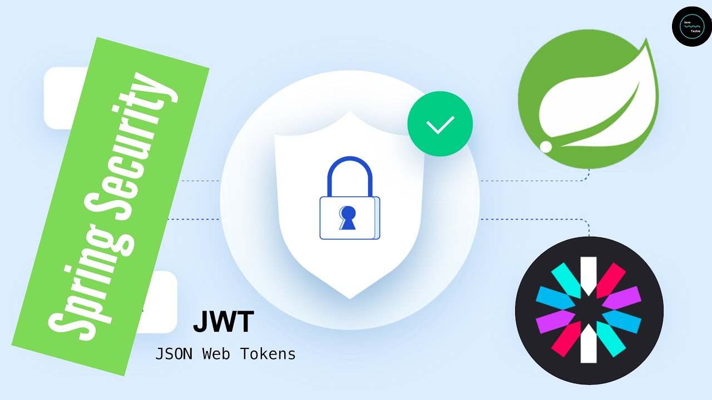

A spring JWT authentication restful service API for Great OutDoors.	
	
server.port=9000	

spring.application.name=authentication_service	

## Description 	
	

## Sequence flow

## Data source	
spring.datasource.url=jdbc:oracle:thin:@localhost:1521:orcl  	

spring.datasource.username=sprint2db	

spring.datasource.password=student123	

spring.jpa.show-sql=true	

spring.jpa.hibernate.ddl-auto=update	

spring.jpa.properties.dialect=org.hibernate.dialect.OracleDialect	

## Current Actors
	
* USER	

* ADMIN	

* RETAILER	

* PRODUCT_MASTER	

You can change actors at /src/main/java/com/cg/iter/entity/ERole according to your project.

